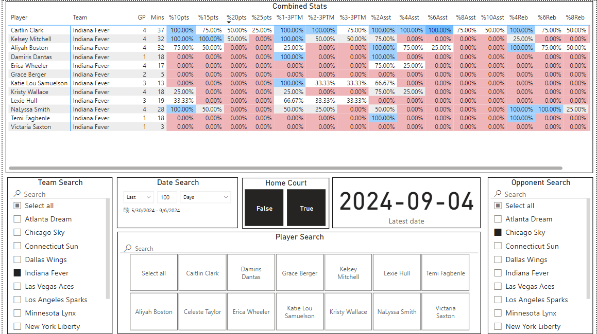

# WNBA 2024 Season Dashboard

This project scrapes WNBA boxscore from [Basketball Reference](https://www.basketball-reference.com/wnba/years/2024_games.html) and stores it into a local Postgres database. Everything (python, postgres, pgadmin) is being run inside a Docker container defined by the [docker-compose](./docker-compose.yaml) file.

### Usage

1. Install Docker 

2. Run `mv dev.env .env` and fill in the necessary variables

3. Run `docker compose up -d` or `docker compose up`

   
### Data Visualization

Power BI was used to create a dashboard highlighting the frequency of players hitting certain stats. For example, %10pts represents the hit rate of a player having 10 or more points in a game. This is useful for player props predictions if the line can be adjusted.

